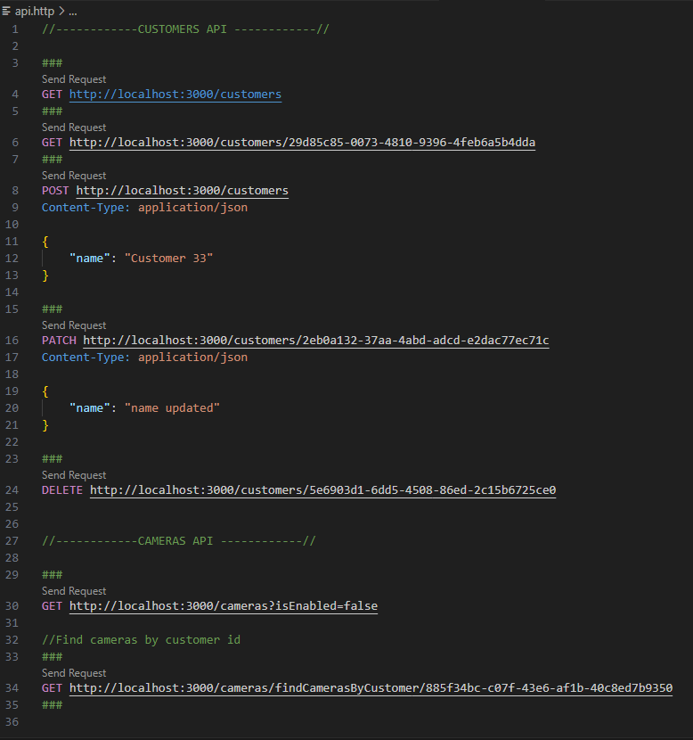
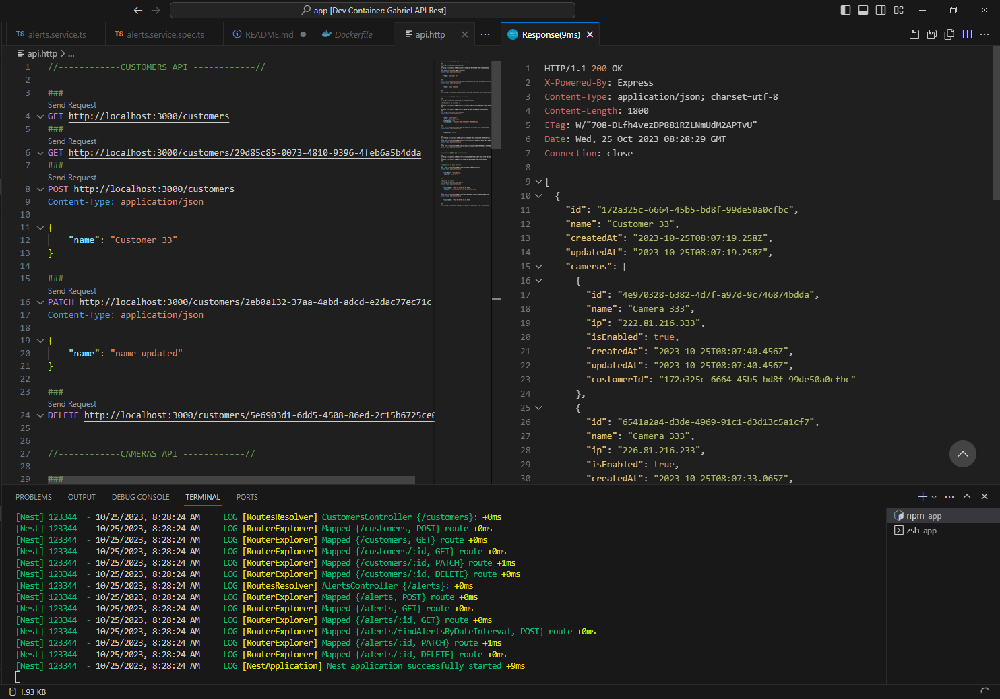
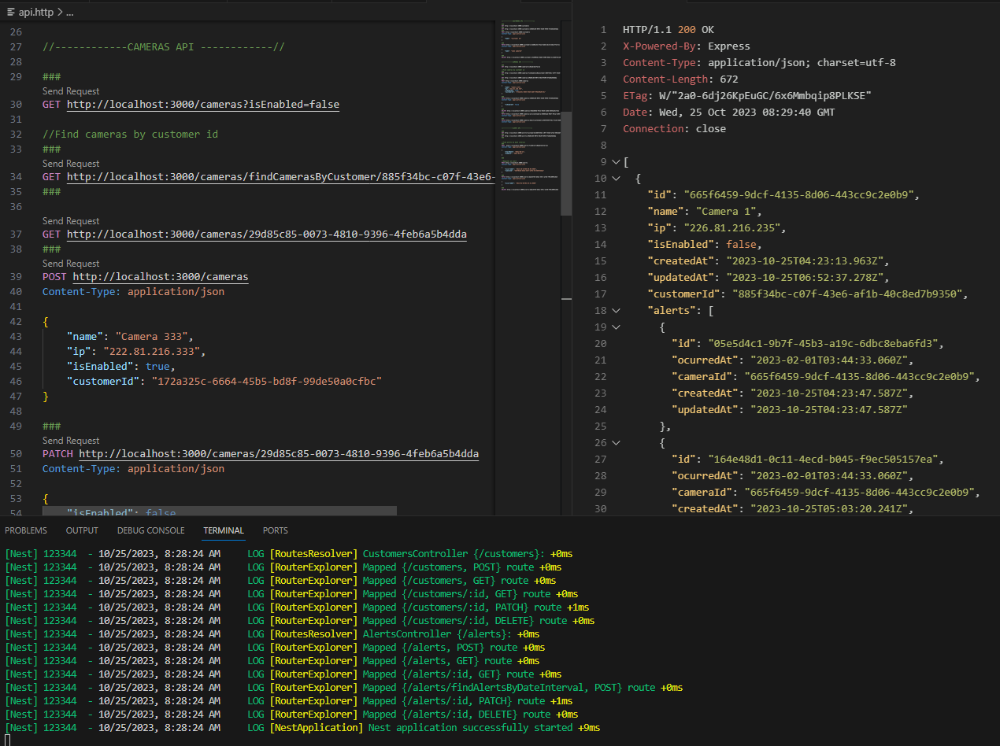
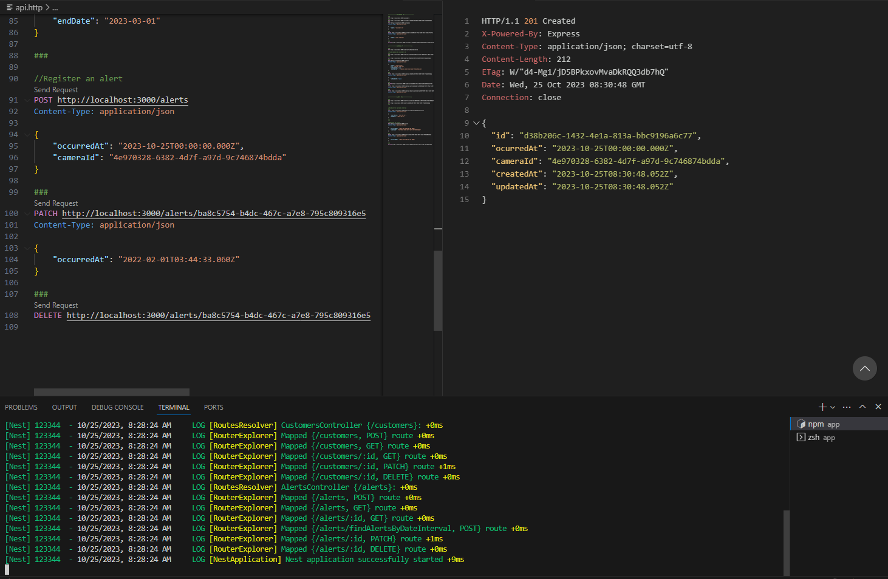

Projeto desenvolvido com a framework NestJS e ORM Prisma.
Foi utilizado o banco de dados não relacional mySQL.

O projeto está estruturado em docker-compose para facilitar os testes em desenvolvimento.

PARA TESTAR:

1 - clonar o projeto e iniciar conexão com os containers

2 - rodar o comando npm run start:dev para iniciar o servidor do nest

3 - utilizar o arquivo api.http, associado a extensão REST Client (já incorporada ao docker-compose)

4 - executar as chamadas HTTP disponibilizadas pelo botão "Send Request". Estão disponibilizadas as APIs de Customers, Cameras e Alerts.

Abaixo apenas alguns exemplos da interface para teste:

Exemplo de request para GET Customers:

Exemplo de request para GET Cameras:

Exemplo de Request para POST um novo alert:

